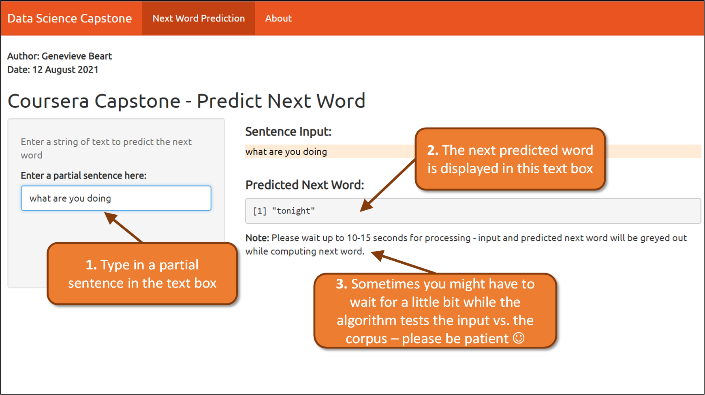

```{r setup, include=FALSE}
knitr::opts_chunk$set(echo = FALSE)
```

## Overview:

The aim of my app was to build a predictive text algorithm with a ShinyApp front end to predict the next word based on a user's inputs. Estimations in this app are based on the sample of a corpus from US News, Twitter and Blogs. This project was inspired by SwiftKey and the predictive text algorithms and work they have undertaken. 

The overall goal here is simple: take text input from the user and predict the next word based on the words that have come before. 

You can try out my app [here](https://circulaic.shinyapps.io/CourseraShinyTextPrediction/).


## User Instructions:
{#id .class width=100% height=100%}

## Preparing the Data for the Shiny App:
1. **Read & sample:** raw News, Twitter and Blogs was read, sampled (75,000 rows each) and combined into one dataset
2. **Data cleaning:** data was cleaned by removing punctuation, converting to lowercase, removing extra white space, and removing numbers
3. **Creating n-grams:** created n-grams, tokenizing then sorting the n-grams by frequency (2-grams, 3-grams, 4-grams and 5-grams created)
4. **Pruning the n-grams:** trimmed the n-gram frequency tables to only include n-grams which appeared at least twice to reduce memory use
5. **Storing the n-grams:** n-gram objects were stored as compressed .RData files so they could be loaded into the ShinyApp

## Logic of the Algorithm Used:

Prediction algorithm was an n-gram model built of "stupid backoff" approach. For the greatest accuracy, prediction is done by first trying to match to the most words possible with the n-gram frequency table and then looking at fewer words if there is no exact match. 

E.g., if 4 words are input then the algorithm will look at these last 4 user-inputted words, test these against the frequency table of the 5-grams to see the most common 5th word given 4 inputted words. If there is no exact match in this table it will look at the 4-grams table, taking the last 3 inputted words to determine the most likely word to follow the input phrase. 

If there are no exact matches, the algorithm will continue to looking at matching increasingly fewer words before it returns the most common unigram ("the") if there are no other matches. 


## Next Steps from Here:

Looking forward, this project could be improved in a number of ways:

1. Include a greater number of n-grams to improve accuracy
2. Reduce the n-gram tables in side to improve the speed of the app
3. Refine the underlying corpus to improve predictions, e.g., if we know the data is coming from Twitter to rely just on the Twitter data 
